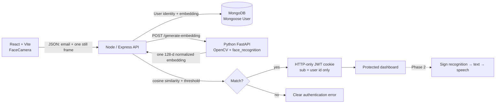

# sign/space — Phase 1 Face Authentication

sign/space is the first phase of a full-stack sign-language assistant. Phase 1 establishes a passwordless identity layer: users register with their name, email, and a camera capture, then authenticate by presenting the same face. Sign-language recognition, hand tracking, translation, speech, and history are intentionally reserved for Phase 2.

## Requirements analysis

The project was designed around the following non-negotiable requirements:

| Requirement | Implementation | Status |
| --- | --- | --- |
| Face instead of password | Registration and login both use a single camera capture and face embedding comparison | Implemented |
| Separate AI service | FastAPI service in `ai-service/` uses OpenCV and `face_recognition` | Implemented |
| MongoDB + Mongoose | User model stores normalized identity fields and a private embedding | Implemented |
| No raw face credential | The API sends one frame to the AI service and persists only the mathematical embedding | Implemented |
| HTTP-only JWT | Successful verification sets an HTTP-only cookie containing only the user ID subject | Implemented |
| Protected dashboard | `/api/user/me` requires a valid JWT cookie; the dashboard redirects unauthenticated visitors | Implemented |
| Camera lifecycle | `FaceCamera` requests permission on demand, captures one JPEG frame, and stops tracks on unmount | Implemented |
| Future-ready architecture | Node API owns authentication; the Python service owns embedding generation; Phase 2 can add recognition without replacing auth | Implemented |

## Architecture



The web app runs as one Node process in the managed environment. The Python process is intentionally separate and is started independently for local development or deployed as its own service. This keeps computer-vision dependencies away from the authentication server and makes future AI model changes isolated.

## Technology stack

- **Frontend:** React, Vite, JavaScript/TypeScript, Tailwind CSS runtime, Wouter, Axios, Lucide React.
- **Backend:** Node.js, Express, Mongoose, MongoDB, JWT, HTTP-only cookies, Helmet, CORS, Express rate limiting.
- **AI:** Python, FastAPI, OpenCV, NumPy, `face_recognition`.
- **Managed scaffold:** WebDev full-stack React + Express project, used as the build and preview shell.

## Folder structure

```text
sign-language-app/
├── ai-service/
│   ├── app.py
│   ├── face_service.py
│   ├── requirements.txt
│   └── utils/
├── client/
│   ├── index.html
│   └── src/
│       ├── components/
│       │   ├── AppShell.tsx
│       │   └── FaceCamera.tsx
│       ├── context/AuthContext.tsx
│       ├── pages/
│       │   ├── AuthLayout.tsx
│       │   ├── Dashboard.tsx
│       │   ├── Home.tsx
│       │   ├── Login.tsx
│       │   └── Register.tsx
│       └── services/api.ts
├── server/
│   ├── config/
│   │   ├── database.ts
│   │   └── env.ts
│   ├── controllers/authController.ts
│   ├── middleware/authMiddleware.ts
│   ├── models/User.ts
│   ├── routes/
│   │   ├── authRoutes.ts
│   │   ├── healthRoutes.ts
│   │   └── userRoutes.ts
│   ├── services/faceService.ts
│   └── _core/index.ts
└── README.md
```

## Prerequisites

1. Node.js 22 or newer.
2. pnpm 10 or newer.
3. Python 3.10 or newer.
4. A MongoDB instance, local or MongoDB Atlas.
5. A browser with camera support. Camera permission works on `localhost` and on HTTPS origins.
6. On Linux, the `face_recognition` dependency may require a C++ compiler and dlib build prerequisites.

## Installation

### 1. Install Node dependencies

```bash
pnpm install
```

### 2. Configure the Node API

Create a `.env` file at the project root. The managed environment keeps secrets outside source control; never commit this file.

```dotenv
PORT=3000
NODE_ENV=development
MONGO_URI=mongodb://127.0.0.1:27017/sign-space
JWT_SECRET=replace-with-a-long-random-secret
PYTHON_AI_URL=http://127.0.0.1:8000
FRONTEND_URL=http://localhost:3000
FACE_MATCH_THRESHOLD=0.82
```

`FACE_MATCH_THRESHOLD` is a cosine-similarity gate. The default `0.82` is a starting point, not a universal biometric policy. Tune it with representative validation data and monitor false accepts versus false rejects.

### 3. Install and run the Python AI service

```bash
cd ai-service
python3 -m venv .venv
source .venv/bin/activate
pip install -r requirements.txt
python app.py
```

The service listens on `http://127.0.0.1:8000`. It exposes `GET /health` and `POST /generate-embedding`. It does not write uploaded frames to disk.

### 4. Start the Node app

From the project root:

```bash
pnpm dev
```

Open `http://localhost:3000`. The managed preview URL can also be used for the UI, but an end-to-end authentication test needs the Node process to reach a configured MongoDB and Python AI service.

## API routes

| Method | Route | Auth | Purpose |
| --- | --- | --- | --- |
| `POST` | `/api/auth/register` | Public + rate limited | Validate name/email, call Python AI, save one user and embedding |
| `POST` | `/api/auth/login` | Public + rate limited | Generate candidate embedding, compare it to the stored template, set JWT cookie on match |
| `POST` | `/api/auth/logout` | Public | Clear the HTTP-only cookie |
| `GET` | `/api/user/me` | JWT cookie | Return safe user fields only |
| `GET` | `/api/health` | Public | Basic Node service health check |
| `POST` | Python `/generate-embedding` | Internal service | Detect exactly one face and return a normalized embedding |

The public user response contains `id`, `name`, `email`, and `createdAt`. It never contains `faceEmbedding`.

## Registration process

1. The user enters a full name and normalized email.
2. The browser requests camera permission only after the user activates the camera.
3. `FaceCamera` renders a mirrored preview and a face-frame overlay.
4. On submit, the client captures three JPEG frames locally. It does not stream video.
5. The Node API checks for an existing email, then sends the three frame bytes to the Python service.
6. Python decodes each frame, detects faces with OpenCV-backed `face_recognition`, rejects zero or multiple faces, and creates a 128-value embedding for each.
7. Node averages and normalizes the three embeddings, then MongoDB stores the name, normalized email, and one enrollment template. The raw frames are discarded.
8. The UI routes the user to face login.

## Login process

1. The user enters the email associated with their account.
2. The browser captures one still frame after camera permission is granted.
3. Python creates a candidate embedding and rejects images with no face, multiple faces, or poor embedding quality.
4. Node loads the registered embedding privately with Mongoose.
5. Node calculates cosine similarity and compares it with `FACE_MATCH_THRESHOLD`.
6. Only a match issues a JWT cookie. The JWT contains only `sub` (the MongoDB user ID) plus standard time claims; it never contains biometric data.
7. The protected dashboard calls `/api/user/me` and displays the safe user identity.

## How face embeddings and matching work

A face embedding is a numerical representation of visual features, not a raw image. The Python service normalizes the embedding vector before returning it to Node. During login, the API calculates cosine similarity:

```text
similarity = dot(candidate, registered) / (||candidate|| * ||registered||)
```

A similarity at or above the configured threshold authenticates the user. A lower value returns a generic face mismatch error. The threshold is centralized in `server/config/env.ts` and should be calibrated with real enrollment and verification samples before production use.

## Security considerations

- Raw face photographs are not stored as the authentication credential.
- The Mongoose embedding field uses `select: false`; normal queries cannot return it accidentally.
- Face embeddings are never returned to the frontend and are not placed in the JWT.
- The JWT is an HTTP-only cookie with `sameSite=lax`; production sets `secure=true`.
- Helmet, request body limits, CORS, input validation, duplicate-email handling, and rate limiting protect the API boundary.
- User-facing errors are intentionally generic and do not expose stack traces, MongoDB credentials, or Python internals.
- The camera stops all media tracks when `FaceCamera` unmounts.
- Only the necessary still frame is sent; continuous video upload is not implemented.
- This is a biometric authentication prototype. Add liveness detection, audit logging, consent/retention controls, model evaluation, and jurisdiction-specific legal review before production deployment.

## Testing checklist

Manual acceptance tests:

- Register a new user with one clear face.
- Attempt the same email twice and confirm a duplicate error.
- Submit with no face and confirm the Python error is surfaced clearly.
- Submit with multiple visible faces and confirm rejection.
- Deny camera permission and confirm the camera-specific error.
- Log in with the correct face and confirm the protected dashboard opens.
- Log in with the wrong person and confirm a face mismatch.
- Use an unknown email and confirm it is rejected.
- Visit `/dashboard` without a cookie and confirm redirect to `/login`.
- Log out and confirm `/api/user/me` rejects the old session.
- Inspect network responses and verify no embedding is returned to the browser.
- Decode the JWT payload and verify it contains only a user ID subject and standard claims.

Type checking:

```bash
pnpm run check
```

## Known limitations

Phase 1 does not include liveness detection, anti-spoofing, multi-sample enrollment aggregation, device binding, password recovery, MFA, hand tracking, sign-to-text, speech, history, gamification, admin tooling, social login, or payments. The `face_recognition` HOG detector is appropriate for a prototype but may need a more robust detector and model evaluation for production environments.

The managed preview shell is a Node process. The Python service and MongoDB are deliberately separate dependencies for local end-to-end execution; configure them before testing actual enrollment and verification.

## Phase 2 plan

The authentication boundary remains unchanged. Phase 2 can add a second AI pipeline behind the authenticated dashboard:

```text
HTTP-only JWT session
        ↓
Protected sign-language workspace
        ↓
Reusable camera stream component
        ↓
Hand / pose model service
        ↓
Sign → text → speech pipeline
```

The existing `FaceCamera` component is intentionally isolated so it can later gain a controlled stream mode for sign-language recognition without changing registration or login. No Phase 2 functionality is implemented in this release.

## DeepFace face-service migration

The AI service now uses **DeepFace** instead of `face_recognition`/dlib. The existing `POST /generate-embedding` endpoint and JSON contract are unchanged, so the Node API and frontend do not require route or request changes.

From PowerShell on Windows:

```powershell
cd ai-service
py -3.11 -m venv .venv
.\.venv\Scripts\Activate.ps1
python -m pip install --upgrade pip
python -m pip install -r requirements.txt
$env:DEEPFACE_MODEL="Facenet512"
$env:DEEPFACE_DETECTOR_BACKEND="opencv"
python app.py
```

In the root `.env` file:

```env
PYTHON_AI_URL=http://127.0.0.1:8000
```

DeepFace may download model weights on first use. The service rejects invalid images, no-face images, multiple-face images, and very small faces. Liveness/anti-spoofing is not implemented and must be added before treating this as production biometric authentication.

Because dlib and DeepFace models produce different embedding formats, users enrolled under the old dlib implementation must re-enroll after this migration. The system must never compare an old 128-value dlib embedding with a new DeepFace embedding.

See [`ai-service/README.md`](ai-service/README.md) for the exact PowerShell endpoint test and environment details.

## Phase 2 — server-side hand gesture canvas

The dashboard now replaces the static Phase 2 preview cards with a live authenticated gesture workspace. The browser captures small JPEG frames, the Node API forwards them to the Python service, and MediaPipe returns one-hand landmarks plus a stable gesture label. Camera frames are not stored; only the user’s canvas strokes, recognized gesture transcript, and last gesture are persisted in MongoDB.

Supported gestures:

| Gesture | Action |
|---|---|
| Pinch | Draw using the index fingertip position |
| Fist | Clear the canvas |
| Victory | Undo the last stroke |
| Thumbs up | Save the workspace to MongoDB |
| Open palm / Point | Add the recognized signal to the transcript |

The Python service adds `POST /recognize-gesture`; the Node app exposes it as the protected `POST /api/gesture/recognize`. User work is available through protected `GET /api/gesture/work` and `PUT /api/gesture/work`. The existing face-authentication endpoints are unchanged.

Install the added Python dependency in the existing virtual environment:

```powershell
cd ai-service
.venv\Scripts\Activate.ps1
python -m pip install -r requirements.txt
```

Start the services in this order:

```powershell
# Terminal 1 — Python AI service
cd ai-service
.venv\Scripts\Activate.ps1
python app.py

# Terminal 2 — Node application
pnpm dev
```

MongoDB must be available for loading and saving the authenticated user’s gesture workspace. If MediaPipe is not installed in an older environment, run `python -m pip install mediapipe==0.10.21` once.

The recognition runs server-side as requested. Accuracy depends on camera quality, lighting, hand size, and the current heuristic gesture classifier; liveness and sign-language sentence translation are future enhancements.
